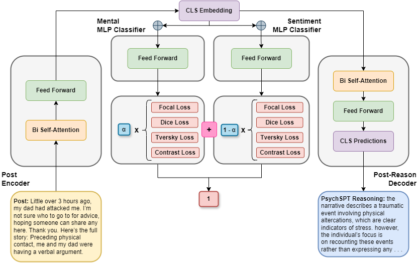

# Towards Explainable and State-of-the-Art AI for Mental Health Research: Scalable Methods in Large Language Models with Strategic Layer Freezing,Document-Level Multi-Loss and Multi-Task Learning, and Diagnostic Reasoning

## PsychSPT: Psychiatric Supportive Pretrained Transformer

This is the code of the <a href="https://arxiv.org/abs/2201.12086">PsychSPT paper</a>.
To install the dependencies, run:
<pre>pip install -r requirements.txt
pip install -e .</pre> 

## Table of Content:
- [x] Pre-trained Checkpoints
- [x] Train Checkpoints (Analogous to Finetune)
- [x] How to Pretrain PsychSPT
- [x] How to Train PsychSPT (Analogous to Finetune)
- [x] Example of PsychSPT Diagnostic Reasoning
- [x] Novel Diagnostic Reasoning Evaluation Framework
- [x] Benchmark Machine Learning Experiments
- [x] Citation

## Pre-trained Checkpoint:
Num. Pre-train Posts |                                                 PsychSPT                                                  |
--- |:---------------------------------------------------------------------------------------------------------:|
4M | <a href="https://drive.google.com/file/d/1WqB8Yo5VikIpEgV1h9FDugd64Tfo2oPb/view?usp=sharing">Download</a> | - | -

### Train Checkpoints (Analogous to Finetune):
Dataset |                                                     PyshcSPT + Classifier                                                      |                                                       PyschSPT + Text Decoder                                                       |
--- |:------------------------------------------------------------------------------------------------------------------------------:|:-----------------------------------------------------------------------------------------------------------------------------------:|
Loneliness Detection | <a href="https://drive.google.com/file/d/1kEdIfNCmFzkL-Hu7CcsI6pZ7i1eTxStY/view?usp=sharing">Download</a>   | <a href="https://drive.google.com/file/d/1BW-8OlXjpwPkkljfBlW_KpGWdGOgJoBL/view?usp=sharing">Download</a>
Dreaddit | <a href="https://drive.google.com/file/d/1i7UtIbovIZYAZ-xeGy9jBXyVca7-qtJ7/view?usp=sharing">Download</a> | <a href="https://drive.google.com/file/d/1wXRh2_p6YVEqfUIlhkjK2T42s7XPKCoc/view?usp=sharing">Download</a>

## How to Pretrain PsychSPT:
1. Crawl 4M posts from Reddit (list of subreddits in the paper). Process the subreddits using prep_corpus_doc.py under ./exec_prep/
2. Adjust parameters in psychspt.yaml under ./configs/pretrain/. The current configs are what I used.
3. Adjust parameters in bert_base.json under ./configs/model/. The current configs are what I used and what Bert-Base-Uncased was train with.
4. To pretrain PsychSPT using 4 GPUs, run:
<pre>python -m torch.distributed.run --nproc_per_node=4 ./exec_pretrain/pretrain.py</pre>

## How to Train PsychSPT (Analogous to Finetune):
1. Choose Dreaddit or Loneliness Detection to train on. Data is under ./data/.
2. Adjust parameters in psychspt.yaml under ./configs/train/. Here are a description of the important parameters and their functionality:
   1. **_encoder_layer_train_**: Options are "all", "last", or "none". This determines which layers to train for the text encoder.
   2. **_decoder_layer_train_**: Options are "all", "last", or "none". This determines which layers to train for the text decoder.
   3. **_decoder_only_**: Options are "yes" or "no". This determines whether to train only the text decoder or not.
   4. **_embed_type_**: Options are "document" or "sentence". This determines whether to encode the entire post or by sentences per post and aggregate by mean.
   4. **_loss_**: Options are "loss_ce", "loss_focal", "loss_dice", "loss_tversky", "loss_constrast", "loss_reason", "loss_angular", "loss_perplex", "loss_center", and "loss_embed_match". Comment a loss to disable it for training. If "loss_reason", "loss_perplex", and "loss_embed_match" are commented, the text decoder will not be trained and only the classifier.
2. To train PsychSPT using 1 GPU, run:
<pre>python ./exec_train/train.py</pre> 
3. To evaluate PsychSPT classification, run:
<pre>python ./exec_eval/eval_nocaps.py </pre> 
4. To generate PsychSPT diagnostic reasoning, run:
<pre>python ./exec_eval/eval_generate.py </pre> 

## Example of PsychSPT Diagnostic Reasoning:
**Dreaddit Post:** <pre>Little over 3 hours ago, my dad had attacked me. I’m not sure who to go to 
for advice, hoping someone can share any here. Thank you. Here’s the full story: 
Preceding physical contact, me and my dad were having a verbal argument. </pre> 
**PsychSPT Diagnostic Reasoning:**<pre>the narrative describes a traumatic event involving physical altercations,
which are clear indicators of stress. however, the individual’s focus is on 
recounting these events rather than expressing any personal emotional turmoil or distress. 
they mention their father’s actions and subsequent legal consequences, such as 
being jailed for domestic violence without prior intervention. while there is an 
element of self-blame in the description, it does not conveyx overwhelming 
anxiety or helplessness typically associated with high levels of stress. instead, 
the tone remains relatively composed and factual throughout. </pre> 

## Novel Diagnostic Reasoning Evaluation Framework
To follow our Cosine Similarity and Jaccard Similarity evaluation steps introduced in our paper's 
novel diagnostic reasoning evaluation framework, run:
<pre>python ./exec_eval_reason/eval_reason_cos_sim.py
python ./exec_eval_reason/eval_reason_jaccard.py</pre> 

## Benchmark Machine Learning Experiments
To follow our benchmark machine learning experiments for our Loneliness Detection dataset, run these files in order:
<pre>
python ./exec_benchmark/benchmark_cls_token_emb.py
python ./exec_benchmark/benchmark_log_reg.py
python ./exec_benchmark/benchmark_svm.py
python ./exec_benchmark/benchmark_xgb.py
python ./exec_benchmark/benchmark_cnn.py
</pre> 

## Citation
If you find this code to be useful for your research, please consider citing.
<pre>
@inproceedings{fan2024psychspt,
      title={Towards Explainable and State-of-the-Art AI for Mental Health Research: Scalable Methods in Large Language Models with Strategic Layer Freezing,Document-Level Multi-Loss and Multi-Task Learning, and Diagnostic Reasoning},
      author={Jonathan Fan, Winston Fan, Ling Tong, Jiyuan Li, and Weiguo Fan},
      year={2024},
}</pre>